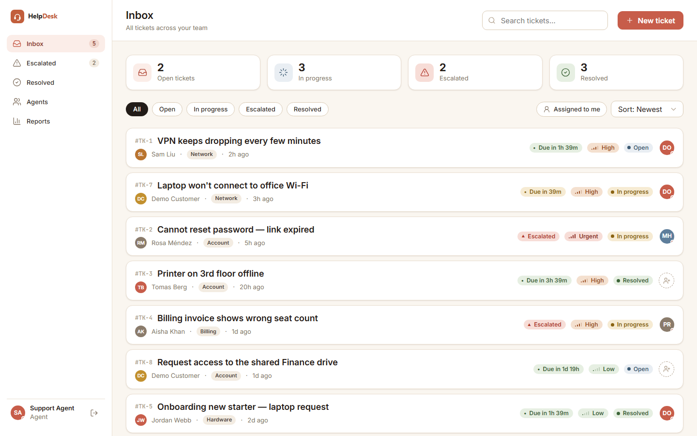
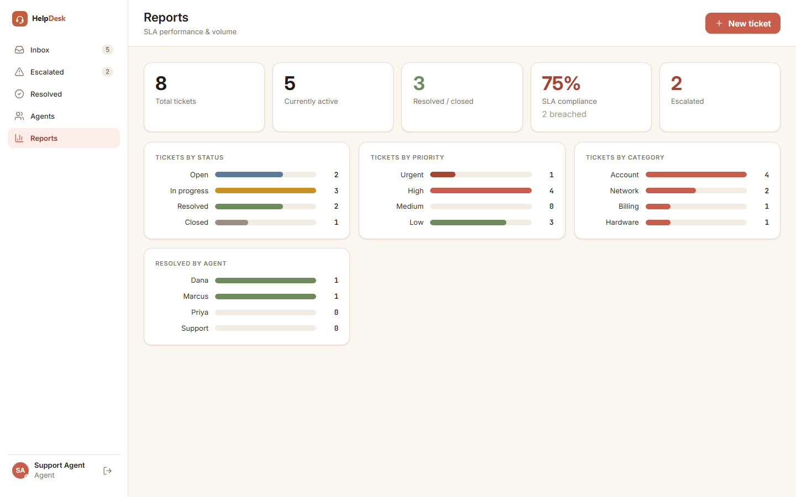
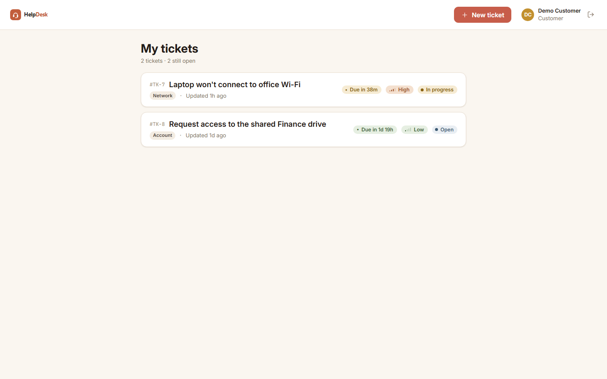

# HelpDesk API

[](https://github.com/MohammadAlfalah/helpdesk-api/actions/workflows/ci.yml)
[](https://helpdesk-api-9d3d.onrender.com/swagger)


A ticketing REST API in ASP.NET Core 10. Customers raise support tickets; agents triage, assign, comment on and resolve them. A background job watches every open ticket and escalates the ones that breach their SLA.

I built this to have a backend project that goes past CRUD and shows the things real APIs actually need — role-scoped auth, a service layer I can unit-test without spinning up a web server, proper REST semantics, and a background worker doing useful work on a timer. The SLA escalation job is the part I cared most about getting right.

It also serves its own web app, so the one deployment is both the API and a working UI you can click around in.

**Live demo:** <https://helpdesk-api-9d3d.onrender.com/swagger> — log in via `POST /api/auth/login` with the seeded agent (`agent@helpdesk.local` / `Agent#12345`), hit **Authorize**, paste `Bearer <token>`, and try the endpoints. It's on Render's free tier, so the first request after it's been idle takes ~30s to wake up.

[](https://helpdesk-api-9d3d.onrender.com/swagger)

## The web app

The API hands its own UI out of `wwwroot` at the site root, and it's role-aware after sign-in. Agents get a support console — a live inbox with search, sort (newest / oldest / SLA-due / priority), status filters and an "assigned to me" view, plus a ticket slide-over to read the thread, post public replies or internal notes, assign, change status / priority / category, resolve / close / reopen / delete. There's also an Agents page (team + workload) and a Reports dashboard (SLA compliance %, volume, and breakdowns by status / priority / category / agent).




Customers get a self-service portal: register or sign in, raise a ticket, track its status and SLA, and reply to the agent. They only ever see their own tickets and never internal notes — and that's enforced by the API, not just hidden in the UI.



The front end is React + Babel running in the browser with no build step, styled from a small terracotta-themed design system I keep in [`design-system/`](design-system/). It's all static files, which kept the deploy simple.

## What's in it

- **Tickets** — create, list, view, update, assign, delete. Status flows `Open → InProgress → Resolved → Closed`; priority is `Low/Medium/High/Urgent`; plus a category.
- **JWT auth with two roles**, agent and customer. Customers are scoped to their own tickets; agents manage everything. Passwords are hashed with BCrypt.
- **Comments**, including internal agent-only notes that are never returned to customers.
- **SLA escalation background job** — a hosted `BackgroundService` periodically finds open tickets past their SLA due time, flags them as escalated, and bumps their priority a level.
- **REST done properly** — resource routes, correct status codes (`201` + `Location`, `204`, `403`, `404`, `409`), DTOs, model validation, and RFC 7807 `ProblemDetails` error bodies.
- **Pagination, filtering, search and sorting** on the ticket list, with paging metadata in the body and an `X-Pagination` header.
- **Tests** — 19 unit tests on in-memory SQLite, plus 6 integration tests that hit the real HTTP API against a PostgreSQL container via Testcontainers (including a check that one customer can't reach another's tickets at the HTTP layer).
- **CI + deploy** — GitHub Actions builds, tests, and builds the Docker image on every push; a `render.yaml` Blueprint provisions the API and a free Postgres in one go.

## Stack

| Concern | Tech |
|---|---|
| Framework | ASP.NET Core 10 (C#) |
| Database | PostgreSQL + EF Core 10 (Npgsql) |
| Auth | JWT bearer tokens with roles, BCrypt hashing |
| Docs | Swagger / OpenAPI |
| Background work | Hosted `BackgroundService` + `PeriodicTimer` |
| Tests | xUnit · `WebApplicationFactory` · Testcontainers (PostgreSQL) |
| Tooling | Docker, Docker Compose, GitHub Actions, Render |

## How it's laid out

```
Controllers ─▶ TicketService (rules + authorization) ─▶ EF Core ─▶ PostgreSQL
   JWT/roles                                   ▲
   SlaEscalationService (BackgroundService) ───┘ uses SlaEscalationRunner
```

Controllers stay thin — they map a `ServiceResult` onto the right HTTP status. The actual rules (role scoping, SLA timing, comment visibility) live in the service layer so I can test them directly. The domain is small: a `User` (customer or agent) raises a `Ticket` that can be assigned to an agent and carries a thread of `Comment`s (public or internal).

## Running it

### Docker (easiest)

```bash
docker compose up --build
```

Swagger lands at <http://localhost:8090/swagger>, the web app at <http://localhost:8090/>. The database is created, migrated and seeded with realistic tickets on first run — including a couple the SLA job escalates right away, so both sides of the UI have something to show.

### Locally

You'll need the .NET 10 SDK and a Postgres instance (`docker compose up db` gives you one). The dev connection string lives in `appsettings.Development.json`.

```bash
cd HelpDesk.Api
dotnet run
```

### Seeded accounts

| Role | Email | Password |
|---|---|---|
| Agent | `agent@helpdesk.local` | `Agent#12345` |
| Customer | `customer@helpdesk.local` | `Customer#12345` |

Or register your own customer via `POST /api/auth/register`.

## API at a glance

Everything under `/api/tickets`, `/api/users` and the comment routes needs `Authorization: Bearer <token>`.

**Auth** — `POST /api/auth/register`, `POST /api/auth/login` (both return `{ token, email, fullName, role }`).

**Tickets** — `GET /api/tickets` (customers see only their own), `GET /{id}`, `POST /`, `PUT /{id}` *(agent)*, `POST /{id}/assign` *(agent)*, `DELETE /{id}` *(agent)*, plus `GET|POST /{id}/comments` (`isInternal` is honoured only for agents).

**Users** — `GET /api/users/me`, `GET /api/users/agents` *(agent)*.

The ticket list takes filters (`status`, `priority`, `category`, `assignedAgentId`, `createdById`, `escalated`), a case-insensitive `search` over title + description, `sort` (`createdAt | updatedAt | priority | status | slaDueAt`, optional `asc`/`desc`), and `page` / `pageSize` (default 20, max 100):

```bash
BASE=http://localhost:8090

TOKEN=$(curl -s -X POST $BASE/api/auth/login -H "Content-Type: application/json" \
  -d '{"email":"agent@helpdesk.local","password":"Agent#12345"}' | jq -r .token)

curl -X POST $BASE/api/tickets -H "Authorization: Bearer $TOKEN" \
  -H "Content-Type: application/json" \
  -d '{"title":"VPN keeps dropping","description":"Disconnects every few minutes","category":"Network","priority":"High"}'

curl "$BASE/api/tickets?priority=High&status=Open&sort=slaDueAt%20asc" -H "Authorization: Bearer $TOKEN"
```

## The SLA escalation job

Each priority has a resolution target, and a ticket's `slaDueAt` is stamped from that when it's created. Defaults (configurable under the `Sla` section in `appsettings.json`):

| Priority | Target |
|---|---|
| Urgent | 1 hour |
| High | 4 hours |
| Medium | 24 hours |
| Low | 72 hours |

[`SlaEscalationService`](HelpDesk.Api/Background/SlaEscalationService.cs) wakes up every 60s (also configurable) and, for each still-open ticket whose SLA has lapsed, sets `isEscalated`, records `escalatedAt`, and bumps the priority one level (capped at Urgent). I pulled the actual pass out into [`SlaEscalationRunner`](HelpDesk.Api/Services/SlaEscalationRunner.cs) so the escalation logic can be unit-tested without the timer or a host.

## Tests

```bash
dotnet test
```

Unit tests run on in-memory SQLite and need nothing extra. The integration tests start a real PostgreSQL container through Testcontainers and exercise the live HTTP API, so they need Docker running. CI runs both on every push.

## Deploying your own

`render.yaml` is a Render Blueprint: on [dashboard.render.com](https://dashboard.render.com) pick **New ▸ Blueprint** against this repo and it provisions the Docker service plus a free Postgres, generates a JWT signing key, and wires the connection string in. Public Swagger ends up at `https://<your-service>.onrender.com/swagger`. Note that Render's free Postgres is deleted ~30 days after creation — fine for a demo, bump to a paid plan for anything you want to keep.

The JWT key is never committed: locally it comes from `appsettings.Development.json`, in Docker from `Jwt__Key` (override the demo default with a `.env` — see `.env.example`), and on Render it's generated. The app refuses to start without a key of at least 32 bytes.

## What I'd add next

- Refresh tokens and an admin role for user management
- Email notifications on assignment / status change
- Attachments on tickets

## License

MIT — see [LICENSE](LICENSE).
