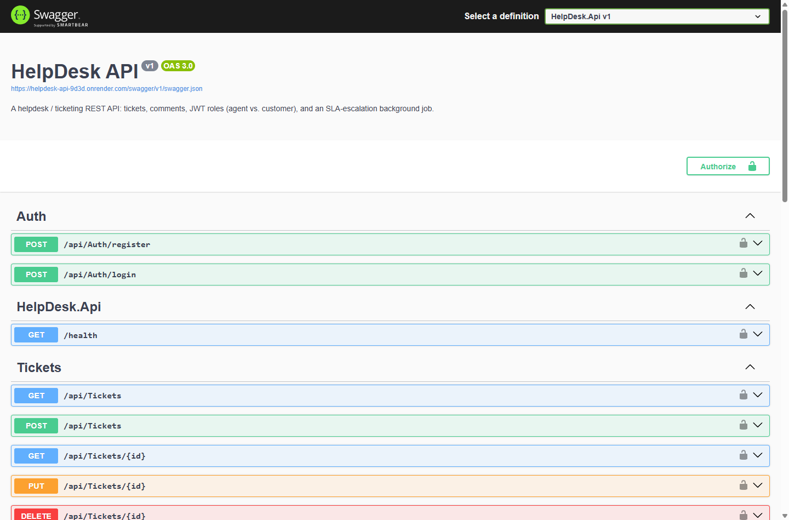

# HelpDesk API

[](https://github.com/MohammadAlfalah/helpdesk-api/actions/workflows/ci.yml)
[](https://helpdesk-api-9d3d.onrender.com/swagger)


A **helpdesk / ticketing REST API** built with ASP.NET Core 10. Customers raise
support tickets; agents triage, assign, comment on and resolve them. A background
job watches every open ticket and **automatically escalates the ones that breach
their SLA**.

It's a clean, production-shaped backend: role-based JWT auth, a service layer,
PostgreSQL via EF Core, pagination/filtering/sorting, RFC 7807 error responses,
Swagger, a unit + integration test suite, CI, and a one-command Docker setup.

> **🌐 Live demo:** **<https://helpdesk-api-9d3d.onrender.com/swagger>** — interactive Swagger UI.
> Log in via `POST /api/auth/login` with the seeded agent (`agent@helpdesk.local` / `Agent#12345`),
> click **Authorize**, paste `Bearer <token>`, and try the endpoints.
> _(Hosted on Render's free tier, so the first request after it's been idle takes ~30 s to wake.)_

[](https://helpdesk-api-9d3d.onrender.com/swagger)

---

## Features

- **Tickets** — create, list, view, update, assign, delete; status (`Open → InProgress → Resolved → Closed`), priority (`Low/Medium/High/Urgent`) and category.
- **Role-based auth (JWT)** — two roles, **agent** and **customer**. Customers only ever see and comment on their *own* tickets; agents see and manage everything.
- **Comments** with **internal agent-only notes** that are never returned to customers.
- **SLA escalation background job** — a hosted `BackgroundService` periodically finds open tickets past their SLA due time, flags them as escalated and bumps their priority (the depth feature — see below).
- **Proper REST design** — resource routes, correct status codes (`201` + `Location`, `204`, `403`, `404`, `409`), DTOs, model validation, and **consistent ProblemDetails (RFC 7807)** error bodies.
- **Pagination, filtering, full-text search and sorting** on the ticket list, with pagination metadata in both the body and an `X-Pagination` header.
- **Tested** — 19 unit tests (services, SLA rules, authorization) + 6 integration tests that hit the real HTTP API against a **real PostgreSQL container** (Testcontainers), including cross-customer access being blocked at the HTTP layer.
- **CI** — GitHub Actions builds, runs the full test suite, and builds the Docker image on every push.
- **Deploy-ready** — `Dockerfile`, `docker compose up`, and a **Render Blueprint** (`render.yaml`) that provisions the API + a free Postgres in one click.

## Tech stack

| Concern | Technology |
|---|---|
| Framework | ASP.NET Core 10 (C#) |
| Database | PostgreSQL + Entity Framework Core 10 (Npgsql) |
| Auth | JWT bearer tokens with roles, BCrypt password hashing |
| Docs | Swagger / OpenAPI (with a "Authorize" button) |
| Background work | Hosted `BackgroundService` + `PeriodicTimer` |
| Tests | xUnit · `WebApplicationFactory` · Testcontainers (PostgreSQL) |
| Tooling | Docker, Docker Compose, GitHub Actions, Render |

## Domain model

```
User (Customer | Agent)
  └─ raises ─▶ Ticket ──── assigned to ───▶ User (Agent)
                 │  status, priority, category, SLA due / escalation
                 └─ has ─▶ Comment (public | internal)
```

## Architecture

```
Controllers ─▶ TicketService (rules + authorization) ─▶ EF Core ─▶ PostgreSQL
   JWT/roles                                   ▲
   SlaEscalationService (BackgroundService) ───┘ uses SlaEscalationRunner
```

Controllers are thin and map a `ServiceResult` to HTTP status codes; all business
rules (role scoping, SLA timing, comment visibility) live in the service layer so
they can be unit-tested without a web server.

---

## Getting started

### Option A — Docker (recommended)

```bash
docker compose up --build
```

Swagger is then at **http://localhost:8080/swagger**. The database is created and
migrated automatically, and two accounts are seeded.

### Option B — Run locally

Needs the .NET 10 SDK and a PostgreSQL instance (the connection string lives in
`appsettings.Development.json`).

```bash
cd HelpDesk.Api
dotnet run        # Swagger at the URL printed in the console
```

### Seeded accounts

| Role | Email | Password |
|---|---|---|
| Agent | `agent@helpdesk.local` | `Agent#12345` |
| Customer | `customer@helpdesk.local` | `Customer#12345` |

Or register your own customer via `POST /api/auth/register`.

---

## API reference

All `/api/tickets`, `/api/users` and comment endpoints require
`Authorization: Bearer <token>`.

### Auth — `/api/auth`
| Method | Route | Description |
|---|---|---|
| `POST` | `/register` | Register a customer; returns `{ token, email, fullName, role }`. |
| `POST` | `/login` | Log in (works for seeded agents too). |

### Tickets — `/api/tickets`
| Method | Route | Who | Description |
|---|---|---|---|
| `GET` | `/` | any | List tickets (see query params below). Customers see only their own. |
| `GET` | `/{id}` | any | Get one ticket. |
| `POST` | `/` | any | Raise a ticket. |
| `PUT` | `/{id}` | agent | Update status / priority / category. |
| `POST` | `/{id}/assign` | agent | Assign (or unassign) to an agent. |
| `DELETE` | `/{id}` | agent | Delete a ticket. |
| `GET` | `/{id}/comments` | any | List comments (customers never see internal notes). |
| `POST` | `/{id}/comments` | any | Add a comment (`isInternal` is honoured only for agents). |

### Users — `/api/users`
| Method | Route | Who | Description |
|---|---|---|---|
| `GET` | `/me` | any | The current user. |
| `GET` | `/agents` | agent | List agents (for assignment). |

### List query parameters

```
GET /api/tickets?status=Open&priority=High&category=Network
                &assignedAgentId=2&escalated=true&search=vpn
                &sort=slaDueAt%20asc&page=1&pageSize=20
```

- **Filter:** `status`, `priority`, `category`, `assignedAgentId`, `createdById`, `escalated`
- **Search:** `search` (case-insensitive over title + description)
- **Sort:** `sort` = `createdAt | updatedAt | priority | status | slaDueAt` + optional `asc`/`desc`
- **Paginate:** `page` (default 1), `pageSize` (default 20, max 100)

The response is `{ items, page, pageSize, totalCount, totalPages, hasNextPage, hasPreviousPage }`.

### Quick walkthrough

```bash
BASE=http://localhost:8080

# Log in as the seeded agent
TOKEN=$(curl -s -X POST $BASE/api/auth/login -H "Content-Type: application/json" \
  -d '{"email":"agent@helpdesk.local","password":"Agent#12345"}' | jq -r .token)

# Create a ticket
curl -X POST $BASE/api/tickets -H "Authorization: Bearer $TOKEN" \
  -H "Content-Type: application/json" \
  -d '{"title":"VPN keeps dropping","description":"Disconnects every few minutes","category":"Network","priority":"High"}'

# List high-priority open tickets, newest first
curl "$BASE/api/tickets?priority=High&status=Open" -H "Authorization: Bearer $TOKEN"
```

---

## The SLA escalation job (depth feature)

Each priority has an SLA resolution target (configurable in `appsettings.json`):

| Priority | Target |
|---|---|
| Urgent | 1 hour |
| High | 4 hours |
| Medium | 24 hours |
| Low | 72 hours |

When a ticket is created, its `slaDueAt` is stamped from that target.
[`SlaEscalationService`](HelpDesk.Api/Background/SlaEscalationService.cs) runs every
minute (configurable), and for every still-open ticket whose SLA has lapsed it sets
`isEscalated`, records `escalatedAt`, and **bumps the priority one level** (capped at
Urgent). The pass itself lives in
[`SlaEscalationRunner`](HelpDesk.Api/Services/SlaEscalationRunner.cs) so it can be
unit-tested directly.

---

## Running the tests

```bash
dotnet test
```

- **Unit tests** run on in-memory SQLite — fast, no Docker needed.
- **Integration tests** spin up a real PostgreSQL container via **Testcontainers** and
  exercise the live HTTP API (auth, controllers, EF Core). These need **Docker running**.

---

## Deploying a live demo (Render, free)

1. Push this repo to GitHub.
2. On [dashboard.render.com](https://dashboard.render.com) → **New ▸ Blueprint**, pick this repo.
3. Render reads [`render.yaml`](render.yaml), provisions the API (Docker) **and** a free
   PostgreSQL database, generates a JWT key, and wires the connection in.
4. When it goes green, your public Swagger is at `https://<your-service>.onrender.com/swagger`.

(The free Render web service sleeps after inactivity — the first request after a nap takes a few seconds to wake.)

## Roadmap

- Refresh tokens and an admin role for user management.
- Email notifications on assignment / status change.
- Attachments on tickets.
- Per-agent SLA dashboards.

## License

MIT — see [LICENSE](LICENSE).
